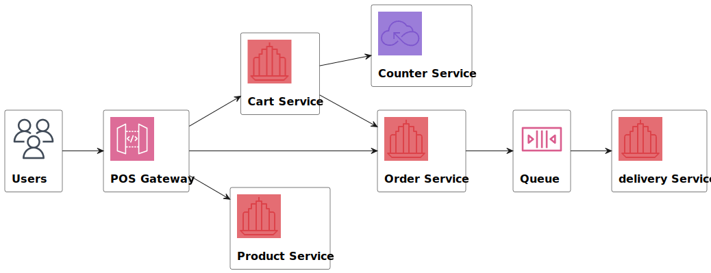

*. 实现两个微服务：order/deliver，分别负责订单和快递记录，两者通过rabbitmq连系
    1. cart在checkout时，向order提交订单，order在处理提交时，向deliver exchange发送新的快递消息
    2. deliver向exchange注册一个consumer，对于每一个快递消息，完成自己的业务逻辑（快递记录）；同时它提供独立接口查询已有快递记录。

*. 修复了作业5的一个错误

# aw07

Please extend your MicroPOS system by adding a delivery service shown as the following figure.

When an order is placed by a user, the order serivce sends out an event into some AMQP MOM (such as RabbitMQ). The delivery service will be notified and a new delivery entry will be generated automatically. User can query the delivery status for his orders.

Use [Spring Cloud Stream](https://spring.io/projects/spring-cloud-stream) to make the scenerio happen. Of coz you can refer to the [demo](https://github.com/sa-spring/stream-loan) for technical details.